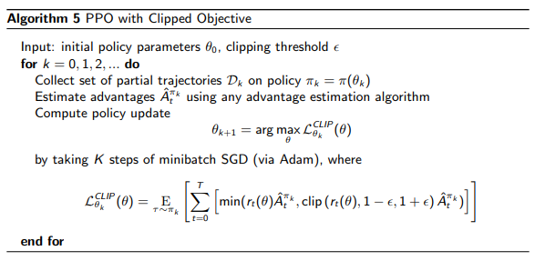
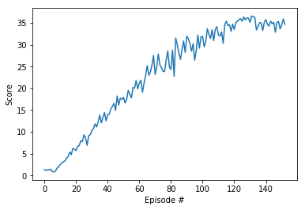

# Report

This project implements a reinforcement learning agent to controls a simulation of a robotic arm. The double-jointed arm can move to target locations. A reward of +0.1 is provided for each step that the agent's hand is in the goal location. Thus, the goal of the agent is to maintain its position at the target location for as many time steps as possible. 
The objective is reach to an average score of +30 (over 100 consecutive episodes, and over all agents). 

The agents is trained using Proximal Policy Optimization (PPO) Algorithm based on the paper released by [OpenAI](https://blog.openai.com/openai-baselines-ppo/).

## Implementation

The implementation split into a few smaller modules: 

* model.py - Neural Network model implemented with PyTorch
* ppo_agent.py - PPO agent implementation as described in [paper](https://arxiv.org/abs/1707.06347) mentioned above
* train.py - imports all required modules and allows the enviroment to be explored and the agent trained
* play.py - Runs an Agent using pre-trained weights from train.py

## Learning Algorithm

Proximal Policy Optimization was chosen to train the agent because it has been [stated](https://blog.openai.com/openai-baselines-ppo/) that PPO performs comparably or better than state-of-the-art approaches while being much simpler to implement and tune.  

The agent in this project utilised code for implementing the PPO alogirthm found in the RL-Adventure-2 [notebook](https://github.com/higgsfield/RL-Adventure-2/blob/master/3.ppo.ipynb).	

In this implementation the agent model comprises of a pair of neural networks, the actor and the critic networks. The actor network is 3 fully connected layers with ReLu activation on the first two layers. The output of the actor network is normal distribution of the action space. The critic has a similar configuration to the actor but it outputs a single value. The actor controls how the agent behaves and the critic measures how good the action taken is.

Compared to other policy gradient methods, PPO has a unique objective function that uses the ratio between old and new policies, scaled by advantages and clipped to limit the size of the update. Mathematically it is defined as:   

[Source](http://rail.eecs.berkeley.edu/deeprlcourse-fa17/f17docs/lecture_13_advanced_pg.pdf)

1. Collect a batch of N transistions from environment given by PPO_STEPS parameter
1. Calculate returns for the using Generalized Advantage Estimation
1. Calculate advantage = returns - values
1. For e epochs given by PPO_EPOCHS parameter
   1. sample enough random mini-batches to cover all data
   1. pass state into network, obtain action, value, entropy and new_log_probs
   1. calculate surrogate policy loss and MSE value loss
   1. backpropogate total loss through network 
1. Repeat steps 1-4 until is agent solves environment
1. If agent fails to solve enviroment, tune hyperparameters and repeat steps 1-5

### Hyperparameters

	HIDDEN_SIZE         = 512
	LEARNING_RATE       = 3e-4
	GAMMA               = 0.99
	GAE_TAU             = 0.95
	PPO_CLIP            = 0.2
	PPO_STEPS           = 2048
	MINI_BATCH_SIZE     = 64
	PPO_EPOCHS          = 10
	TARGET_REWARD       = 30

## Results

The agent can achieve an average score of 30 over 100 episodes after 146 episodes

## Ideas for Future Work
---

* Better tuning of hyperparameters, using different activation function for actor such a tanH

* Implement an evolutionary system or genetic algorithm based on this [implementation](https://github.com/PacktPublishing/Deep-Reinforcement-Learning-Hands-On/tree/master/Chapter16). I initally modified this code to run with the Reacher environment [ga_train.py](archive/ga_train.py). However even after several days of training it failed to converge so went on to implement this PPO algorithm. Given more time I would like to delve deeper into this GA/ES approach with more tweaking of learning rates and possibly a better implemetation of cross-over and parent selection.

* Implement a Model-Based RL agent that uses Particle Swarm Optimizatiion [Reinforcement Learning with Particle Swarm Optimization Policy PSO-P in Continuous State and Action Spaces](https://pdfs.semanticscholar.org/d0c4/9a9ed109cb8573217a9a0affbad7881b77a4.pdf)
